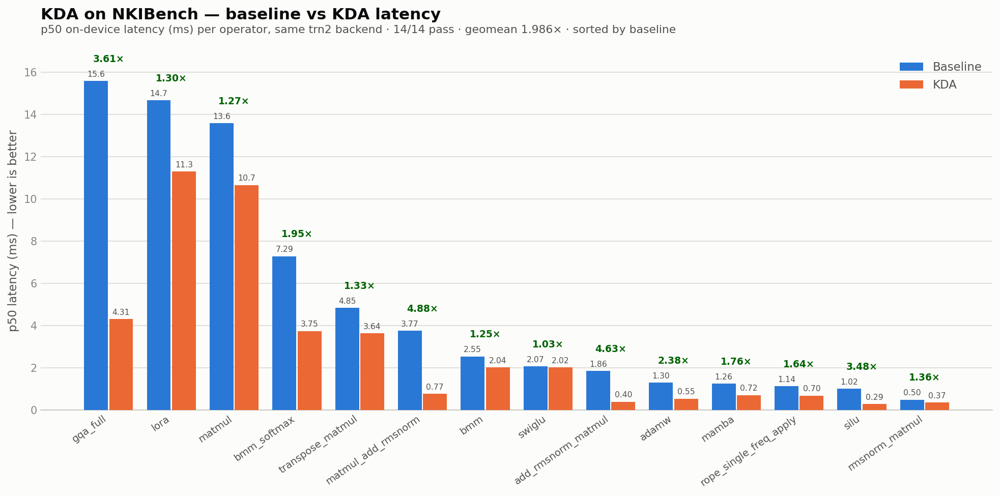

# KDA for Trainium

A Trainium/NKI instantiation of the
[Kernel Design Agents](https://github.com/mit-han-lab/kernel-design-agents) (KDA)
workflow. It drives an agent to research → write → profile → iterate on **NKI
kernels**, and scores them on the **NKIBench** benchmark (from
[AccelOpt](https://github.com/zhang677/AccelOpt)) using a **remote Trainium
profiler** (the machine running this harness has no Neuron hardware).

## Results

Baseline vs KDA p50 latency across the 14 NKIBench operators — all pass the
relative-L2 gate; geomean speedup **1.986×**. See [RESULTS.md](RESULTS.md) for the
per-operator table and winning levers.



## Prerequisites (not included in this repo)

This harness is the driver only; it depends on three external pieces you supply:

- **NKIBench** — the benchmark definition (numpy references + baseline kernels +
  seeds), from [AccelOpt](https://github.com/zhang677/AccelOpt). Clone it and point
  `$NKIBENCH_ROOT` at `AccelOpt/NKIBench` (defaults to `../AccelOpt/NKIBench`).
- **A profiling/evaluation backend** — something that compiles+runs an NKI kernel
  and reports correctness (relative-L2 across seeds) + p50 latency. `verify.py` is a
  **placeholder** here (it documents the input/output contract but ships no
  backend); implement it against your own profiler or hardware. The adapter
  (`adapter/nkibench_case.py`) already assembles each NKIBench case into the kwargs
  your backend needs.
- **NKI skills** (optional) — `.claude/skills/` ships placeholder folders; drop in
  your own skill contents or symlink them from an NKI kernel library.

## What it is

| Piece | Role |
|---|---|
| `verify.py` | NKIBench eval harness — **placeholder** documenting the input/output contract (correctness by relative-L2 across seeds; speedup over baseline; geomean aggregate). Wire in your own profiling backend. |
| `adapter/nkibench_case.py` | Bridges an NKIBench case (numpy reference + tiled kernel, split across two files) into one self-contained module + the kwargs an evaluation backend needs. |
| `prompts/<op>/phase{1,2,3}.md` | NKI/Trainium three-phase optimization prompts (research→correct baseline → profile-driven opt → shape specialization). Generated by `prompts/_gen_prompts.py`. |
| `scripts/run-op.sh` | Headless driver: runs all three phases for one operator end-to-end (draft → gen-plan → commit → RLCR loop → commit) with no manual copy-paste. |
| `.claude/skills/` | Placeholder skill folders (docs, API lookup, instruction-cost, optimization knowledgebase, accuracy debugging); real contents come from an NKI kernel library not shipped here. Profiling skills that need a local build workflow are intentionally excluded — see CLAUDE.md. |
| `baselines.json` | Measured baseline latency per case (generated). |

The optimization *loop engine* is the external **`humanize`** Claude Code plugin
(`/humanize:gen-plan`, `/humanize:start-rlcr-loop`) — same as the GPU KDA.

## Setup

`verify.py` is a placeholder in this release — implement it against your own
profiling/evaluation backend (it documents the required input/output contract at
the top of the file). If your backend needs credentials or environment setup,
put that in `scripts/nki-auth.sh` (a placeholder) and `scripts/kda-env.sh`;
`scripts/setup.sh` sources the env and runs the auth step for you.

Skills are discovered at **project level** under `.claude/skills/` (Claude Code
reads `<project>/.claude/skills/` and `~/.claude/skills/`). This repo ships only
**placeholder** skill folders — their real contents live in a separate NKI kernel
library not distributed here. Only skills that work without a local build-based
test workflow are used (profiling/roofline/separation/DMA skills are excluded
because we measure on the remote profiler — bottleneck data comes from
`verify.py`'s `summary_metrics`; see CLAUDE.md). To wire in your own, drop each
skill's `SKILL.md` into the matching folder or symlink it:

```bash
SKILLSRC=/path/to/nki-kernel-library/.claude/skills   # your local skills source
for name in nki-concept-docs nki-api-reference kernel-cost-analysis \
            kernel-optimization-kb kernel-accuracy-debugging; do
  ln -sfn "$(cd "$SKILLSRC/$name" && pwd)" ".claude/skills/$name"
done
```

`humanize` is installed via the Claude Code plugin marketplace.

## Optimizing one NKI kernel, end to end

The running example is `silu`. Substitute any operator name; the three pilot ops
(`matmul`, `silu`, `rmsnorm_matmul`) already have their baseline cached.

### 0. Terminal setup (once per new terminal)

Source the setup script — sets the profiler + codex env AND refreshes creds
(works from any CWD, bash or zsh):

```bash
cd /path/to/kda-trainium
source scripts/setup.sh
```

### 1. Cache the baseline latency (once per operator)

Speedup is measured against the baseline kernel, so it must be cached first
(otherwise scoring prints speedup `—`). Baselines are shared across tasks, so run
this from the **repo root**. Skip if the op is already in `baselines.json`.

```bash
PY=python3
$PY verify.py --build-baselines --op silu       # or --pilot for all three
$PY verify.py --op silu                          # sanity: baseline vs itself ≈ 1.0x
```

For a brand-new operator, first scaffold its evidence workspace + author prompts:
`bash scripts/new-task.sh <op>` (then add `prompts/<op>/phase{1,2,3}.md`).

### 2. Run the agent loop

**Automated (recommended) — one command, all three phases, no manual steps:**

```bash
bash scripts/run-op.sh silu                 # phases 1→3, headless
bash scripts/run-op.sh silu --from-phase 2 --to-phase 2   # just one phase
```

`run-op.sh` drives the whole loop with headless `claude -p`. For each phase it:
(1) has the agent investigate and write `docs/draft-phaseN.md`, (2) runs
`/humanize:gen-plan` to produce `docs/plan-phaseN.md`, (3) **commits** draft+plan
(the RLCR loop refuses to start on a dirty tree — it needs a clean baseline for
`codex review`), (4) runs `/humanize:start-rlcr-loop --skip-quiz` to implement and
iterate, then commits the result. Per-phase logs land in `workspaces/<op>/logs/`.
Re-running resumes: any phase whose draft/plan already exists or whose
`logs/phaseN.done` marker is present is skipped. Preview without running:
`--dry-run`. The command runs from the **repo root** and scaffolds the workspace
itself if missing.

> Two things the driver does NOT auto-decide for you: if gen-plan's codex pass
> raises a genuine open question, or a phase needs a human judgment call, review
> the phase log before continuing. The numeric contract (rel-tol, seeds, speedup)
> is fixed in the prompt/plan, so those never need a decision.

**Manual (interactive session)** — open a fresh Claude Code session **inside**
`workspaces/<op>/` and, for each phase: write the draft to
`docs/draft-phaseN.md`, then run
`/humanize:gen-plan --input docs/draft-phaseN.md --output docs/plan-phaseN.md`
(explicit `--input`/`--output`; gen-plan has no defaults and errors if the output
exists), then `/humanize:start-rlcr-loop docs/plan-phaseN.md --skip-quiz`.

### 3. Score each candidate (from the task workspace)

```bash
cd workspaces/silu                     # already here from step 2
PY=python3
$PY ../../verify.py --op silu --candidate runs/silu_v2.py --fast   # quick 1-seed check
$PY ../../verify.py --op silu --candidate runs/silu_v2.py          # full 5-seed before promoting
```

Output is `PASS/FAIL + latency + speedup` plus a one-line bottleneck digest
(MFU / engine util / HBM). Record every perf change in `benchmark.csv` and every
candidate in `candidates.jsonl` (parent links = a DAG); keep profiling evidence
under `profile/`.

### 4. Advance the phases

phase1 gets a correct kernel; phase2 does profile-driven optimization (≤5 iters
per direction); phase3 does shape specialization. `run-op.sh` walks all three in
order automatically. In the manual flow, each phase is its own draft → gen-plan →
start-rlcr-loop cycle (use per-phase filenames `docs/{draft,plan}-phaseN.md`).

## Correctness & scoring contract (from NKIBench / AccelOpt)

- **Correct** ⇔ every seed in `[0,21,42,63,84]` passes relative-L2
  `‖v_k − v_r‖₂ < rel_tol·‖v_r‖₂`, `rel_tol=2e-5` (3e-5 for `mamba`), fp32.
- **speedup** = `baseline_latency / candidate_latency` (p50 on-device time).
- **aggregate** = geomean of per-op speedups.

### Measurement caveat

NKIBench's paper baselines were measured on **trn1** via local `nki.baremetal` +
`neuron-profile`. The results here were measured on a **trn2** profiling backend.
To stay apples-to-apples we measure **both** the baseline and the candidate on the
same backend and report the *ratio*, not absolute latency. Absolute numbers
therefore differ from the paper; speedups are the comparable quantity. Kernels are
compiled single-core with `--disable-dge --logical-nc-config=1` to match AccelOpt's
methodology.

## Do not edit

`$NKIBENCH_ROOT/{kernels,reference,seeds,summary.json}` (from
[AccelOpt](https://github.com/zhang677/AccelOpt), defaulting to
`../AccelOpt/NKIBench`) are the benchmark definition — read-only. Baselines and
candidates are measured, never hand-edited.
